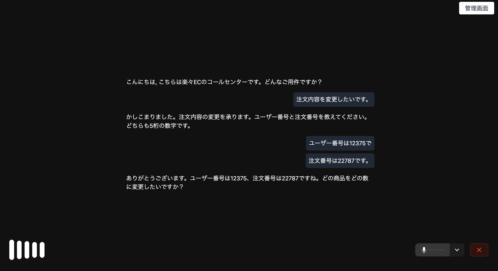
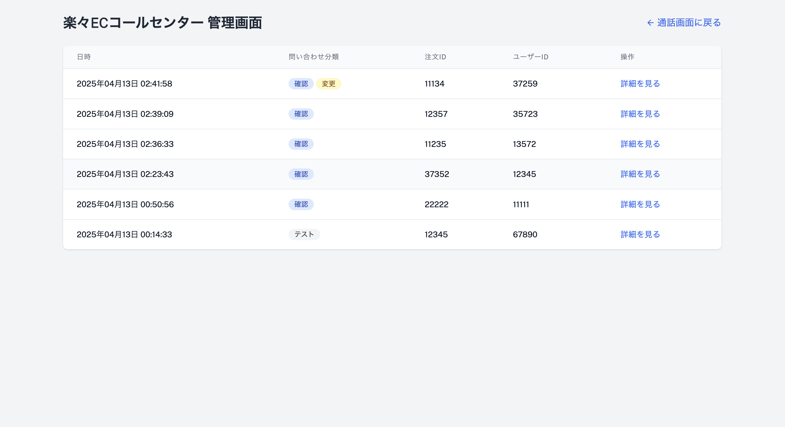

<a href="https://livekit.io/">
  
</a>

# LiveKit Voice Agent(ja)

A complete voice agent application using LiveKit, featuring a Python backend and a Next.js frontend.

## Overview

This project consists of two main components:
- `voice-agent`: Python backend that handles audio processing and agent logic
- `voice-agent-frontend`: Next.js frontend that provides the user interface

This Voice Agent serves as an e-commerce assistant that helps users confirm, modify, or cancel orders, while storing transaction history in a database.

## Screenshots

### Voice Agent Conversation Interface


### Admin Interface


## Quick Setup

Follow these steps to get the application up and running:

### 1. LiveKit Authentication

```bash
# Install LiveKit CLI
brew install livekit-cli

# Authenticate with LiveKit Cloud
lk cloud auth
```

### 2. Backend Setup

```bash
# Navigate to the backend directory
cd voice-agent

# Create a virtual environment
python3 -m venv venv

# Activate the virtual environment
# For Linux/macOS:
source venv/bin/activate
# For Windows:
# venv\Scripts\activate

# Install dependencies
pip install -r requirements.txt

# Create .env.local file (copy from example)
cp .env.example .env.local
```

Edit the `.env.local` file with your LiveKit and OpenAI API credentials:
```
LIVEKIT_API_KEY="your_api_key"
LIVEKIT_API_SECRET="your_api_secret"
LIVEKIT_URL=wss://your-project.livekit.cloud
OPENAI_API_KEY="sk-your_openai_key"
```

### 3. Frontend Setup

```bash
# Navigate to the frontend directory
cd voice-agent-frontend

# Create .env.local file (copy from example)
cp .env.example .env.local

# Install dependencies
pnpm install
```

Edit the `.env.local` file in the frontend directory with your LiveKit credentials:
```
LIVEKIT_API_KEY=your_api_key
LIVEKIT_API_SECRET=your_api_secret
LIVEKIT_URL=wss://your-project.livekit.cloud
```

### 4. Running the Application

Start the backend (in the voice-agent directory with the virtual environment activated):
```bash
# Start the API server
python api.py

# In another terminal (with venv activated), start the agent
python agent.py dev
```

Start the frontend (in the voice-agent-frontend directory):
```bash
pnpm dev
```

Access the application by opening http://localhost:3000 in your browser.

## License

MIT License

Copyright (c) 2025 LiveKit, Inc.

Permission is hereby granted, free of charge, to any person obtaining a copy
of this software and associated documentation files (the "Software"), to deal
in the Software without restriction, including without limitation the rights
to use, copy, modify, merge, publish, distribute, sublicense, and/or sell
copies of the Software, and to permit persons to whom the Software is
furnished to do so, subject to the following conditions:

The above copyright notice and this permission notice shall be included in all
copies or substantial portions of the Software.

THE SOFTWARE IS PROVIDED "AS IS", WITHOUT WARRANTY OF ANY KIND, EXPRESS OR
IMPLIED, INCLUDING BUT NOT LIMITED TO THE WARRANTIES OF MERCHANTABILITY,
FITNESS FOR A PARTICULAR PURPOSE AND NONINFRINGEMENT. IN NO EVENT SHALL THE
AUTHORS OR COPYRIGHT HOLDERS BE LIABLE FOR ANY CLAIM, DAMAGES OR OTHER
LIABILITY, WHETHER IN AN ACTION OF CONTRACT, TORT OR OTHERWISE, ARISING FROM,
OUT OF OR IN CONNECTION WITH THE SOFTWARE OR THE USE OR OTHER DEALINGS IN THE
SOFTWARE. 